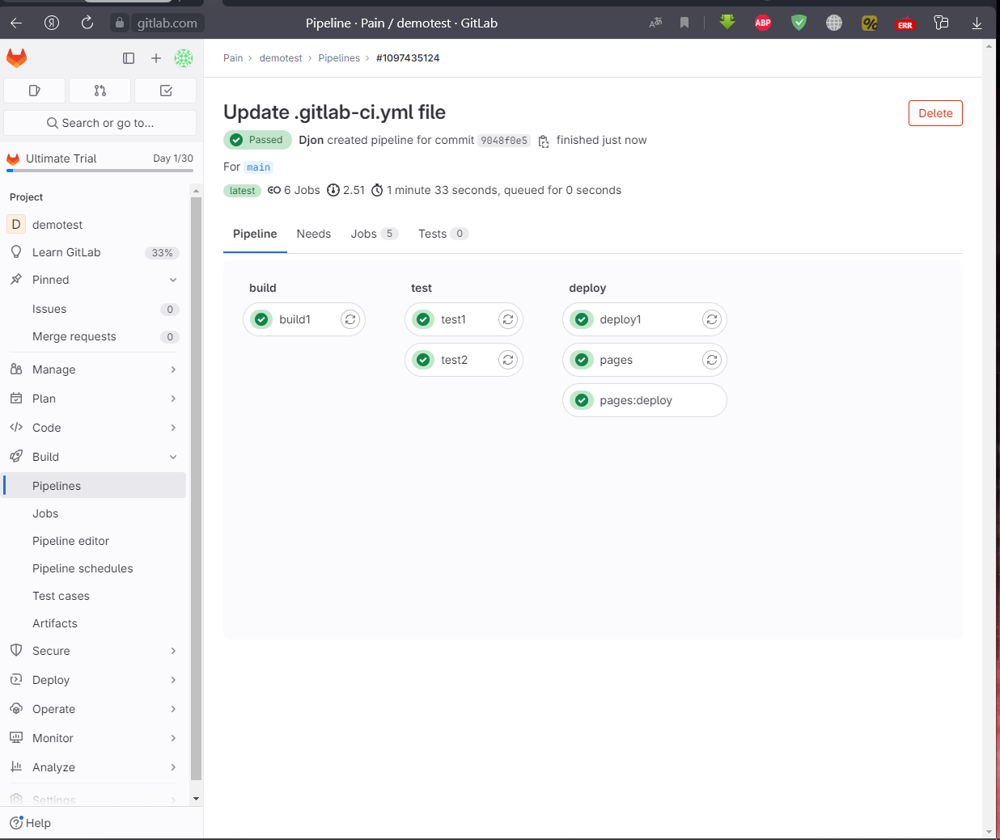
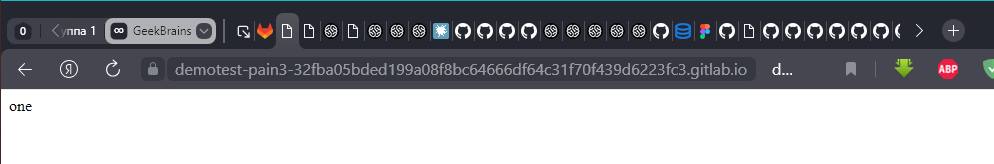
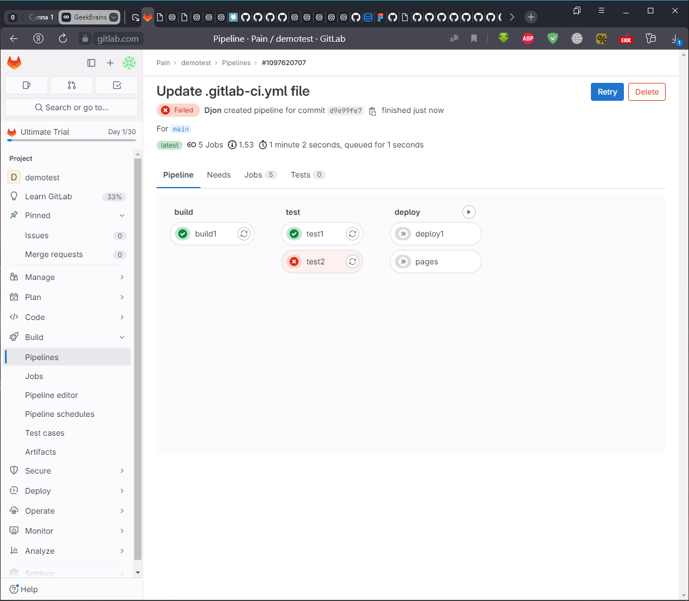

# CI/CD. Семинар 01

## Задача
1. Зарегистрироваться на gitlab.com
2. Создать pipeline и runner
3. Попробовать сохранить артефакт одной из стадий + исключить из папки с артефактами любой файл
4. Попробовать сделать любую gitlab pages

Решение 1,2,4
```yaml
stages:
    - build
    - test
    - deploy
before_script:
    - echo "Before script section"
    - echo "For example you might run an update here or install a build dependency"
    - echo "Or perhaps you might print out some debugging details"
after_script:
    - echo "After script section"
    - echo "For example you might do some cleanup here"
build1:
    stage: build
    script:
        - echo "Do your build here"
        - echo one >> artifact.txt
    artifacts:
        paths:
            - artifact.txt
        expire_in: 1 week
test1:
    stage: test
    script:
        - echo "Do a test here"
        - echo "For example run a test suite"
        - grep one artifact.txt
test2:
    stage: test
    script:
        - echo "Do another parallel test here"
        - echo "For example run a lint test"
deploy1:
    stage: deploy
    script:
        - echo "Do your deploy here"
    environment: production
pages:
    stage: deploy
    script:
        - mkdir -p public
        - cp artifact.txt public/index.html
    artifacts:
        paths:
            - public
    only:
        - main


```

В пайплайне создаётся страничка index.html с текстом one

3. Добавляем тест, он не пройдет так как ссылается на не существующий артефокт:
```yaml
...
test2:
    stage: test
    script:
        - echo "Do a test here"
        - echo "For example run a test suite"
        - grep two artifact.txt
...
```

