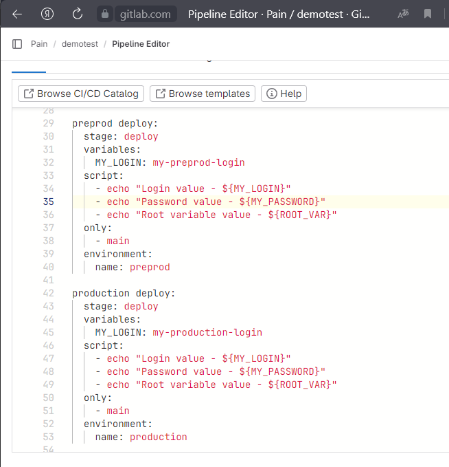
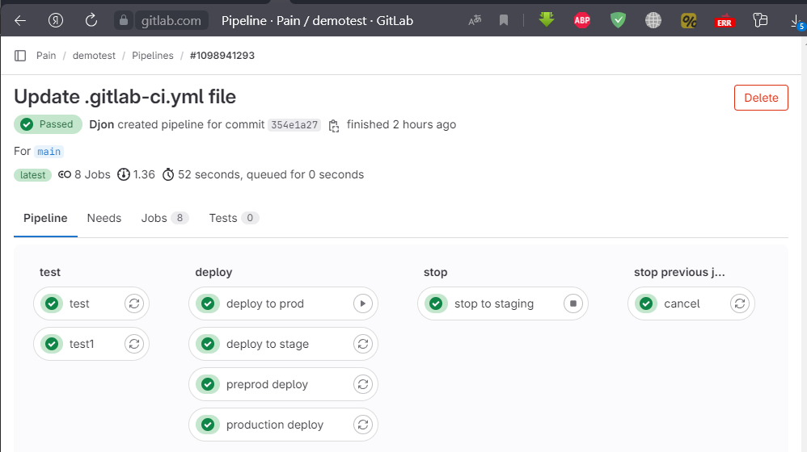
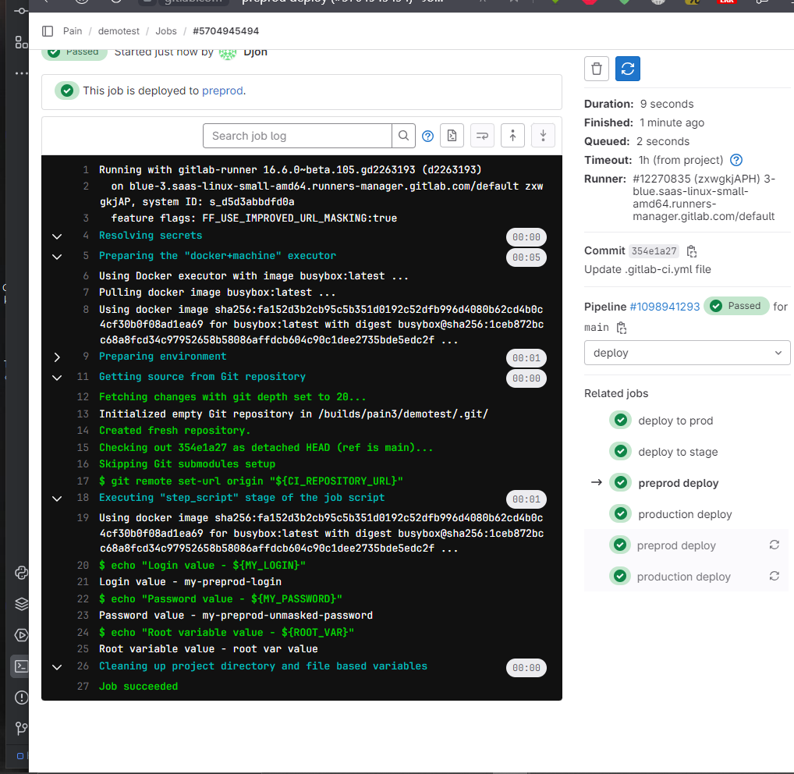
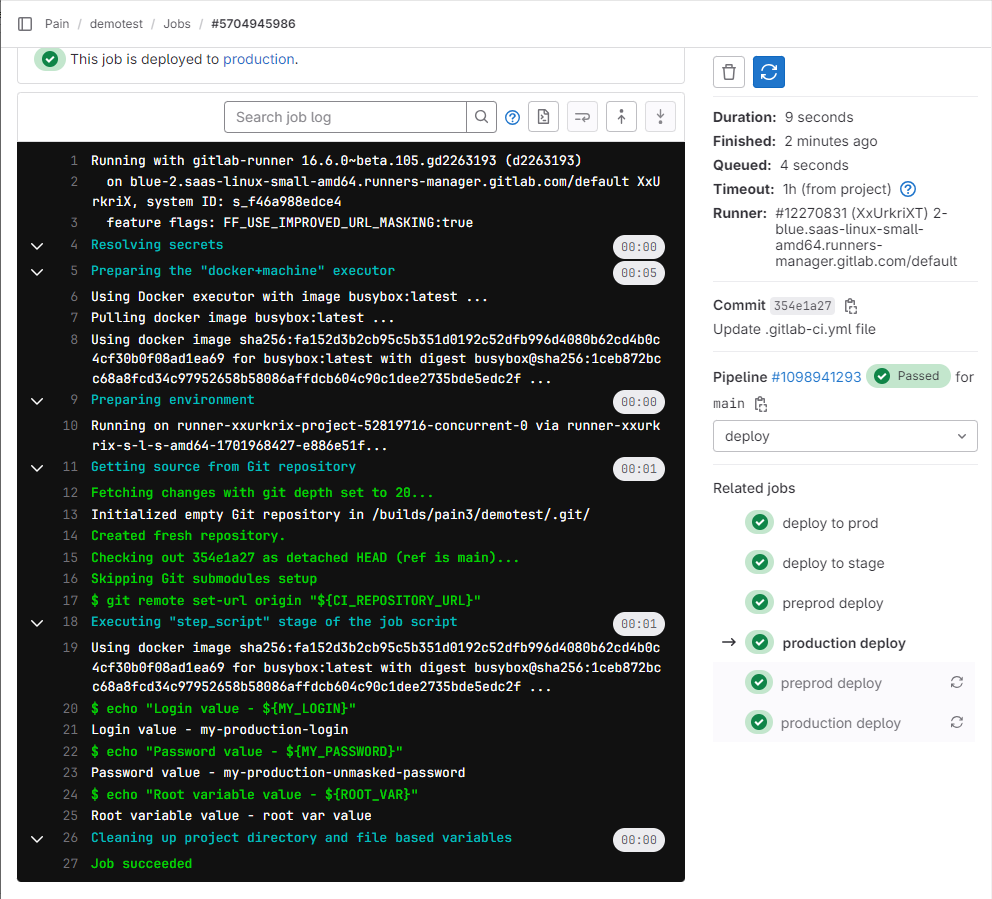

# Домашнее задание по Уроку 3 Continuous delivery и continuous deployment (непрерывная доставка и развертывание)


## Задание 1
Добавить 2 окружения "preprod" и "production".  
Добавить отдельные deploy job для каждой среды.  
Добавить переменную "$MyLogin" внутри .gitlab-ci.yml, которая будет меняться в зависимости от среды.  
Добавить переменную "$MyPassword" не используя .gitlab-ci.yml, которая так же будет меняться в зависимости от среды.

## Решение к заданию 1


Создал две джобы для стадии deploy - `preprod deploy` и `production deploy`.

В обеих джобах создаем переменную `MY_LOGIN` с разными значениями.

В настройках гитлаба (Настройки -> CI/CD -> Variables) создаем две переменные `MY_PASSWORD` под разные среды - `preprod` и `production`. С разными значениями. Не маскируем, чтобы проверить, что в разных средах будут разные значения.

Результат выполнения джобы `pipeline`:

Результат выполнения джобы `preprod deploy`:



Результат выполнения джобы `production deploy`:




## Задание 2
Добавить скрипт в .gitlab-ci.yml, который найдёт все запущенные pipeline по названии ветки(ref) и остановит их.

## Решение к заданию 2

1. В профайле создали Access Token с именем `RUNNER_TOKEN`.

2. На странице [Настройки -> CI/CD -> Variables] создали переменную с таким же названием `RUNNER_TOKEN` и со значением, скопированным из `RUNNER_TOKEN` в Access Token.

3. Добавили скрипт с использованием образа с функциональностью curl и нашей переменной `RUNNER_TOKEN` в опции `PRIVATE-TOKEN`:

```
cancel:
  stage: stop previous jobs
  image: everpeace/curl-jq
  script:
    - |
      if [ "$CI_COMMIT_REF_NAME" == "main" ]
        then
          (
            echo "Cancel old pipelines from the same branch except last"
            OLD_PIPELINES=$( curl -s -H "PRIVATE-TOKEN: $RUNNER_TOKEN" "https://gitlab.com/api/v4/projects/${CI_PROJECT_ID}/pipelines?ref=${CI_COMMIT_REF_NAME}&status=running" \
                  | jq '.[] | .id' | tail -n +2 )
                  for pipeline in ${OLD_PIPELINES}; \
                      do echo "Killing ${pipeline}" && \
                        curl -s --request POST -H "PRIVATE-TOKEN: ${RUNNER_TOKEN}" "https://gitlab.com/api/v4/projects/${CI_PROJECT_ID}/pipelines/${pipeline}/cancel"; done
          ) || echo "Canceling old pipelines (${OLD_PIPELINES}) failed"
      fi
```

**Ссылка на gitlab_ci.yaml:** https://gitlab.com/pain3/demotest/-/blob/main/Les_3/.gitlab-ci.yml
